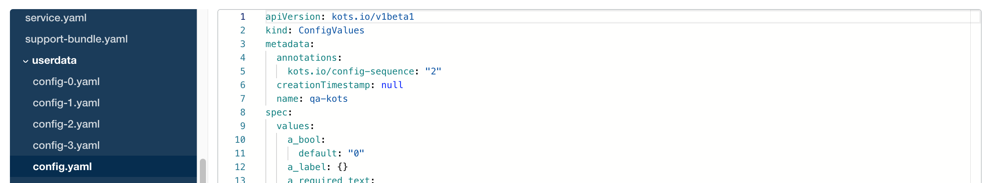

# Allow editing and deploying existing application version.

Once an application is installed, Admin Console will automatically check for updates, and these updates will be automatically added to version history but not deployed.
Admin Console only allows updating configuration of the latest release on this list, which is not the one that is deployed.
In order to update the currently running version, vendors have to move license to a new channel and promote that release to the new channel.

## Goals

- Allow deploying any application version with updated configuration.
- Preserve configuration change history.
- Preserve ability to calculate YAML diff due to config changes.
- Keep the number of application versions managebale.
- Keep the complexity of config update manageable.
Right now only one version archive needs to be read and one archive needs to be written.

## Non Goals

- UI design for viewing config change history.
- UI design for viewing YAML diff for config changes.
- Rolling back deployed changes.
This can be achieved with:
  - `kots download`/`kots upload` commands
  - by updating config again using previous value(s).

## Background

In some cases application upgrades must go through a process that can take weeks.
However during this time an application configuration may need to be updated.

## High-Level Design

When application configuration is updated, the `upstream` spec does not change.
Only the contents of the `upstream/userdata/config.yaml` are changed.
The contents of the `base` spec are then generated from `upstream` and `config.yaml`.
The proposal is to allow modifying application version archives and versioning `config.yaml` within the archive.

## Detailed Design

1. `ConfigValues` will be versioned within the `upstream/userdata/` directory.
   - Config version sequence will be zero-based.
   - Annotation `kots.io/config-sequence` will be added to ConfigValues spec.
   - Current configuration will be stored in `upstream/userdata/config.yaml` (same file as now)
   - **All** configurations will be stored in files with version numbers included in the files: `config-N.yaml`

      ```
      apiVersion: kots.io/v1beta1
      kind: ConfigValues
      metadata:
        name: my-app
        annotations:
          kots.io/config-sequence: "1"
      spec:
        values: {}
      ```

1. When navigating to the config screen for a version, all fields will be populated with values of the current config for this version (contents of the `config.yaml` file).
1. When configuration is saved, the new config will be saved in the `config.yaml` and also in the corresponding `config-N.yaml` where the value of N is the same as the value in the `kots.io/config-sequence` annotation.

   

1. Current configuration can be any configuration, not necessarily the one with latest sequence.
1. Saved configuration will always be versioned `MAX(N) + 1`.
1. When a new application version is created, config history will be removed, preserving only the current config file.

#### Config change history

Config change history is preserved in `config-N.yaml` files and can be viewed as a diff using existing commands (`kots download` with the command line `diff` utility).
UI and API can be created to show this diff in Admin Console directly.

#### Rolling back config change

Since previous config is preserved, UI and API can be built to allow deploying a previous version from Admin Console.

#### kots download/upload commands

`kots download` command should allow downloading arbitrary app versions.
The default should always mean latest (current behavior).

`kots upload` command should allow saving the same app version that was retrieved with `kots download`.
The default should create a new version (current behavior).

#### kots set config

`kots set config` should be extended to allow specifying version sequence whose config will be updated.
The default should always mean create new version based on the latest one (current behavior).

## Alternatives Considered

#### Editting existing config in place
This approach, while easy to implement, does not preserve change history without an additional auditlogging system.

#### Applying the same config to all pending versions
This approach would create a new version with new configuration for all pending versions, which will double on every save.
This will also make saving config changes take proportinally longer with the number of pending releases, creating higher likelyhood of errors.

## Security Considerations

None