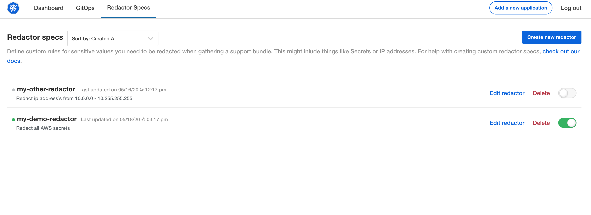

# Individual Redactors API

Add a set of APIs to allow getting/setting redactors by name, not just as a group.

## Goals

- allow listing redactors by name
- allow editing an individual redactor
- allow creating/removing an individual redactor
- allow storing metadata, including enabling/disabling redactors

## Non Goals

- preservation of ordering/comments in the redaction spec

## Background

Custom redactors are being moved to a more informative UI, planned to look something like this:

API routes for individual redactors would greatly simplify implementation and move logic from frontend to backend.


## High-Level Design

Five new API routes will be added - `/api/v1/redacts` to list redactor names, GET/POST/DELETE `/api/v1/redact/spec/{slug}` to get/set/delete them by name, and GET/POST `/api/v1/redact/metadata/{slug}` to get/update metadata for a redactor.
'slug' is the name, in lowercase, with ` ` changed to `-` and symbols removed.

The second set of APIs will not operate on full troubleshoot/Redactor documents - instead, it will operate on the [redact spec itself](https://github.com/replicatedhq/troubleshoot/blob/8f594e876470fa72c6fb0389e8f89fabcde9e017/pkg/apis/troubleshoot/v1beta1/redact_shared.go#L8-L16).
This will result in yaml like the following, which will then be combined when using the existing `/api/v1/redact/get` route:
```yaml
name: replace literal string
values:
- redact-me-first
files:
- literals/a-redact-file
```

`/api/v1/redact/get` will retain the previous behavior. `/api/v1/redact/set` will still add/update redact specs, but it will do so by splitting it into individual redactors and updating those by name.
If no name is provided, one will be autogenerated.

## Detailed Design

### Method Details

The `get` method of `/api/v1/redact/spec/{slug}` will return the following struct:
```go
type GetRedactorsResponse struct {
	Redactor string `json:"redactor"`

	Success bool   `json:"success"`
	Error   string `json:"error,omitempty"`
}
```

`post` to `/api/v1/redact/spec/{slug}` should just be the raw yaml.
If 'name' changes in the yaml, the name will be changed.
If 'name' is removed, it will be readded.

It will return `RedactorMetadataResponse`.

`delete` to `/api/v1/redact/spec/{slug}` will return 200 on success.


Getting `/api/v1/redacts` wil return this:

```go
type ListRedactorsResponse struct {
	Redactors []RedactorList `json:"redactors"`

	Success bool   `json:"success"`
	Error   string `json:"error,omitempty"`
}

type RedactorList struct {
	Name        string    `json:"name"`
	Slug        string    `json:"slug"`
	Created     time.Time `json:"createdAt"`
	Updated     time.Time `json:"updatedAt"`
	Enabled     bool      `json:"enabled"`
	Description string    `json:"description"`
}
```

`post` to `/api/v1/redact/metadata/{slug}` should be of the following form:
```go
type PostRedactorMetadata struct {
	Name        string `json:"name"`
	Enabled     bool   `json:"enabled"`
	Description string `json:"description"`
}
```
If 'name' is not the empty string and is modified, the name of the redactor will be changed.
Future requests will need to use the new path.

`get` to `/api/v1/redact/metadata/{slug}` will return
```go
type RedactorMetadataResponse struct {
	Redactor RedactorList `json:"redactor"`

	Success bool   `json:"success"`
	Error   string `json:"error,omitempty"`
}
```

### Backend Changes

Storing metadata about individual redactors requires additional changes.
Currently, all redactors are stored as a yaml document at the `kotsadm-redact` key within the `kotsadm-redact` configmap.
Now, redactors will be stored individually at the `<name>` key within the `kotsadm-redact` configmap.
Further, instead of storing raw yaml there, an object containing metadata and the redactor will be stored.

```go
type RedactorMetadata struct {
	Metadata RedactorList `json:"metadata"`

	Redact v1beta1.Redact `json:"redact"`
}
```

## Security Considerations

There are no security considerations for this change.
